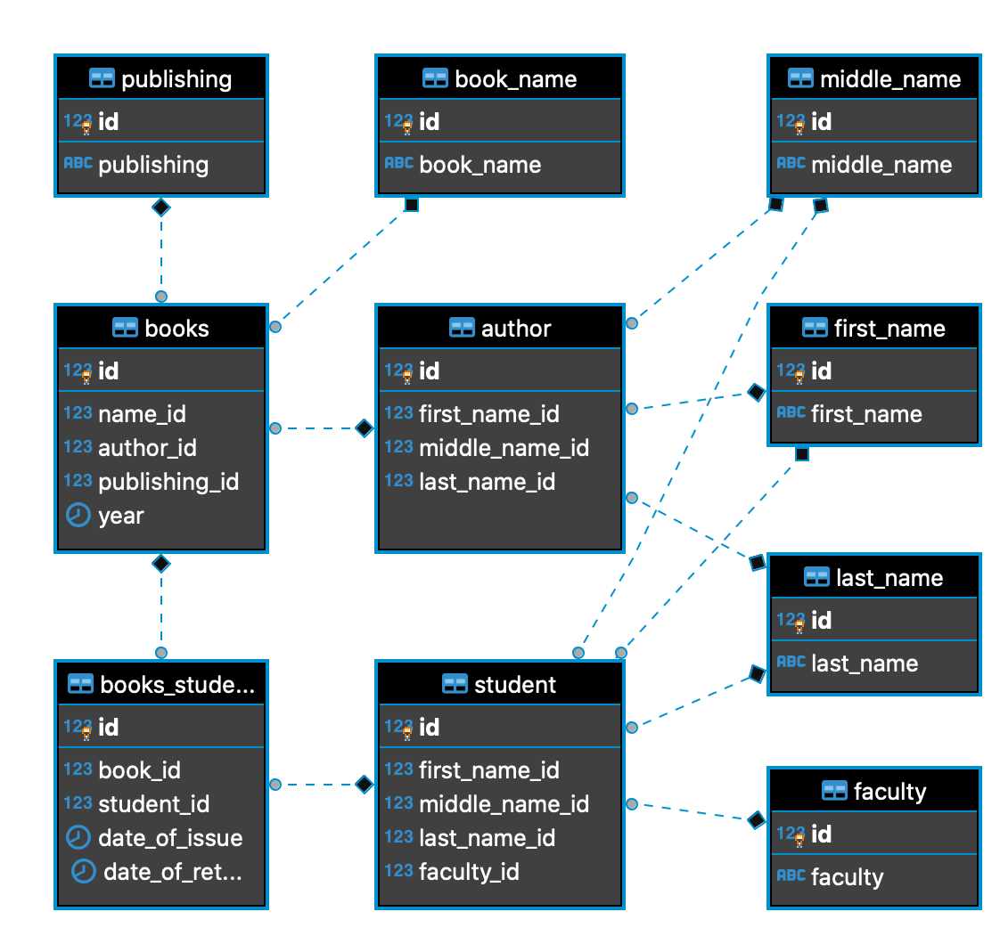

# Тестовое задание для стажеров аналитиков-технологов

Необходимо разработать некоторые части приложения для учета книг в библиотеке. Описание данных, с которыми будет работать приложение – ниже.

Приложение для учета книг в библиотеке должно:

1. Хранить названия книг, ФИО авторов, наименования издательств, год издания.
2. Учитывать имеющиеся в библиотеке экземпляры конкретной книги.
3. Учитывать студентов, которым выдавалась конкретная книга. При каждой выдаче книги студенту, фиксируется дата выдачи. При возврате – дата возврата книги.

## Задания:

1. Опишите модель данных (в любом удобном для вас представлении) для обслуживания библиотеки. Это может быть описание таблиц с типами данных, диаграмма – что угодно.

Указанную модель данных удобно представить в виде следующей ER-диаграммы:



2. Напишите SQL-запрос, который бы возвращал самого популярного автора за год. Запрос должен основываться на модели данных, которую вы описали в задании 1. 

Запишем указанный запрос и, для наглядности, выполним его средствами Python:


```python
import psycopg2 as pg
import pandas as pd

class DBexecutor:
    
    def __init__(self, params):
        self.params = params
        self.conn, self.curs = self.connect_db()
        
    def connect_db(self):
        try:
            conn = pg.connect(**self.params)
            conn.set_session(autocommit=True)
            if conn:
                curs = conn.cursor()
                return conn, curs
        except Exception:
            print('Ошибка подключения к БД')
            return None, None
        
    def __del__(self):
        if self.conn:
            self.curs.close()
            self.conn.close()
```


```python
params = {
    'dbname': 'library',
    'user': 'postgres',
    'password': ''
        }

db = DBexecutor(params)

df = pd.read_sql("""
                select first_name, middle_name, last_name
                from books_students bs
                inner join books b on book_id = b.id
                inner join author a2 on author_id = a2.id
                inner join first_name fn on first_name_id = fn.id
                inner join middle_name mn on middle_name_id = mn.id
                inner join last_name ln2 on last_name_id = ln2.id
                where bs.date_of_issue between '2019-01-01' and '2019-12-31'
                group by first_name, middle_name, last_name 
                order by count(bs.id) desc
                limit 1;
                """, db.conn)

df
```


<div>
<table border="1" class="dataframe">
  <thead>
    <tr style="text-align: right;">
      <th></th>
      <th>first_name</th>
      <th>middle_name</th>
      <th>last_name</th>
    </tr>
  </thead>
  <tbody>
    <tr>
      <th>0</th>
      <td>Моисей</td>
      <td>Павлович</td>
      <td>Венгров</td>
    </tr>
  </tbody>
</table>
</div>


3. Определите понятие «злостный читатель».  Предложите алгоритм для поиска самого злостного читателя библиотеки. На любом языке программирования опишите алгоритм поиска такого читателя. Алгоритм должен основываться на модели данных, которую вы описали в задании 1.

Определим понятие «злостный читатель» - пусть «злостным» является такой читатель, который с начала года допускал задержку возврата книг, в среднем, более чем на 14 дней. Максимально допустимый срок возврата книг примем равным 30 дням. Выполним запрос для поиска таких читателей в БД:


```python
db = DBexecutor(params)

df = pd.read_sql("""
                select first_name, middle_name, last_name, faculty 
                from books_students bs 
                inner join student s on student_id = s.id
                inner join first_name fn on first_name_id = fn.id
                inner join middle_name mn on middle_name_id = mn.id
                inner join last_name ln2 on last_name_id = ln2.id
                inner join faculty f on faculty_id = f.id
                where bs.date_of_issue between '2020-01-01' and '2020-06-26'
                group by first_name, middle_name, last_name, faculty 
                having sum(date_of_return - date_of_issue - 30) / count(bs.id) > 14
                order by last_name::bytea;
                """, db.conn)
df
```


<div>
<table border="1" class="dataframe">
  <thead>
    <tr style="text-align: right;">
      <th></th>
      <th>first_name</th>
      <th>middle_name</th>
      <th>last_name</th>
      <th>faculty</th>
    </tr>
  </thead>
  <tbody>
    <tr>
      <th>0</th>
      <td>Вениамин</td>
      <td>Магафурович</td>
      <td>Айпин</td>
      <td>Факультет радиотехники и электроники (РЭФ)</td>
    </tr>
    <tr>
      <th>1</th>
      <td>Абрам</td>
      <td>Трифонович</td>
      <td>Амусин</td>
      <td>Физико-технический факультет (ФТФ)</td>
    </tr>
    <tr>
      <th>2</th>
      <td>Владимир</td>
      <td>Вадимовна</td>
      <td>Балков</td>
      <td>Факультет гуманитарного образования (ФГО)</td>
    </tr>
    <tr>
      <th>3</th>
      <td>Татьяна</td>
      <td>Лазаревич</td>
      <td>Белецкий</td>
      <td>Факультет гуманитарного образования (ФГО)</td>
    </tr>
    <tr>
      <th>4</th>
      <td>Валерий</td>
      <td>Максович</td>
      <td>Гейченко</td>
      <td>Факультет энергетики (ФЭН)</td>
    </tr>
    <tr>
      <th>5</th>
      <td>Андрей</td>
      <td>Матвеевич</td>
      <td>Иванченко</td>
      <td>Факультет летательных аппаратов (ФЛА)</td>
    </tr>
    <tr>
      <th>6</th>
      <td>Виталий</td>
      <td>Семёновна</td>
      <td>Мартынов</td>
      <td>Факультет гуманитарного образования (ФГО)</td>
    </tr>
    <tr>
      <th>7</th>
      <td>Кронид</td>
      <td>Прокопьевич</td>
      <td>Оношко</td>
      <td>Факультет бизнеса (ФБ)</td>
    </tr>
    <tr>
      <th>8</th>
      <td>Рувим</td>
      <td>Бертильевич</td>
      <td>Пельский</td>
      <td>Факультет прикладной математики и информатики ...</td>
    </tr>
    <tr>
      <th>9</th>
      <td>Рувим</td>
      <td>Фомич</td>
      <td>Писахов</td>
      <td>Факультет мехатроники и автоматизации (ФМА)</td>
    </tr>
    <tr>
      <th>10</th>
      <td>София</td>
      <td>Арсеньевич</td>
      <td>Черман</td>
      <td>Механико -технологический факультет (МТФ)</td>
    </tr>
  </tbody>
</table>
</div>


В с помощью данного запроса мы объединяем таблицы books_students, student, first_name, middle_name, last_name и faculty, группируем записи по ФИО студентов, для каждой полученной группы выполняем расчет отношения числа дней просрочки к числу записей о получении и возврате книги и фильтруем полученный результат, отсекая значения менее 14.

Аналогичного результата мы можем достичь запросив данные из БД и выполнив дальнейшую обработку средствами Python:


```python
import datetime

db = DBexecutor(params)

df = pd.read_sql("""
                select * 
                from books_students bs 
                inner join student s on student_id = s.id
                inner join first_name fn on first_name_id = fn.id
                inner join middle_name mn on middle_name_id = mn.id
                inner join last_name ln2 on last_name_id = ln2.id
                inner join faculty f on faculty_id = f.id
                """, db.conn)
data = df[['date_of_issue', 'date_of_return', 'first_name', 'middle_name', 'last_name', 'faculty']]
filter_after = data['date_of_issue'] >= datetime.date(2020, 1, 1)
filter_before = data['date_of_issue'] <= datetime.date(2020, 6, 26)
data = data.loc[filter_before & filter_after]
```


```python
data['delta'] = data['date_of_return'] - data['date_of_issue'] - pd.Timedelta(30, unit='d')
group_data = data.groupby(['first_name', 'middle_name', 'last_name', 'faculty']).agg(['sum', 'count']).reset_index()
group_data['av_delay'] = group_data[['delta'][0]]['sum'] / group_data[['delta'][0]]['count']
filter_delay = group_data['av_delay'].dt.round(freq = 'D') > pd.Timedelta(14, unit='d')
group_data.loc[filter_delay].sort_values('last_name').reset_index()[['first_name', 'middle_name', 'last_name', 'faculty']]
```


<div>
<table border="1" class="dataframe">
  <thead>
    <tr>
      <th></th>
      <th>first_name</th>
      <th>middle_name</th>
      <th>last_name</th>
      <th>faculty</th>
    </tr>
    <tr>
      <th></th>
      <th></th>
      <th></th>
      <th></th>
      <th></th>
    </tr>
  </thead>
  <tbody>
    <tr>
      <th>0</th>
      <td>Вениамин</td>
      <td>Магафурович</td>
      <td>Айпин</td>
      <td>Факультет радиотехники и электроники (РЭФ)</td>
    </tr>
    <tr>
      <th>1</th>
      <td>Абрам</td>
      <td>Трифонович</td>
      <td>Амусин</td>
      <td>Физико-технический факультет (ФТФ)</td>
    </tr>
    <tr>
      <th>2</th>
      <td>Владимир</td>
      <td>Вадимовна</td>
      <td>Балков</td>
      <td>Факультет гуманитарного образования (ФГО)</td>
    </tr>
    <tr>
      <th>3</th>
      <td>Татьяна</td>
      <td>Лазаревич</td>
      <td>Белецкий</td>
      <td>Факультет гуманитарного образования (ФГО)</td>
    </tr>
    <tr>
      <th>4</th>
      <td>Валерий</td>
      <td>Максович</td>
      <td>Гейченко</td>
      <td>Факультет энергетики (ФЭН)</td>
    </tr>
    <tr>
      <th>5</th>
      <td>Андрей</td>
      <td>Матвеевич</td>
      <td>Иванченко</td>
      <td>Факультет летательных аппаратов (ФЛА)</td>
    </tr>
    <tr>
      <th>6</th>
      <td>Виталий</td>
      <td>Семёновна</td>
      <td>Мартынов</td>
      <td>Факультет гуманитарного образования (ФГО)</td>
    </tr>
    <tr>
      <th>7</th>
      <td>Кронид</td>
      <td>Прокопьевич</td>
      <td>Оношко</td>
      <td>Факультет бизнеса (ФБ)</td>
    </tr>
    <tr>
      <th>8</th>
      <td>Рувим</td>
      <td>Бертильевич</td>
      <td>Пельский</td>
      <td>Факультет прикладной математики и информатики ...</td>
    </tr>
    <tr>
      <th>9</th>
      <td>Рувим</td>
      <td>Фомич</td>
      <td>Писахов</td>
      <td>Факультет мехатроники и автоматизации (ФМА)</td>
    </tr>
    <tr>
      <th>10</th>
      <td>София</td>
      <td>Арсеньевич</td>
      <td>Черман</td>
      <td>Механико -технологический факультет (МТФ)</td>
    </tr>
  </tbody>
</table>
</div>


```python
del db
```
